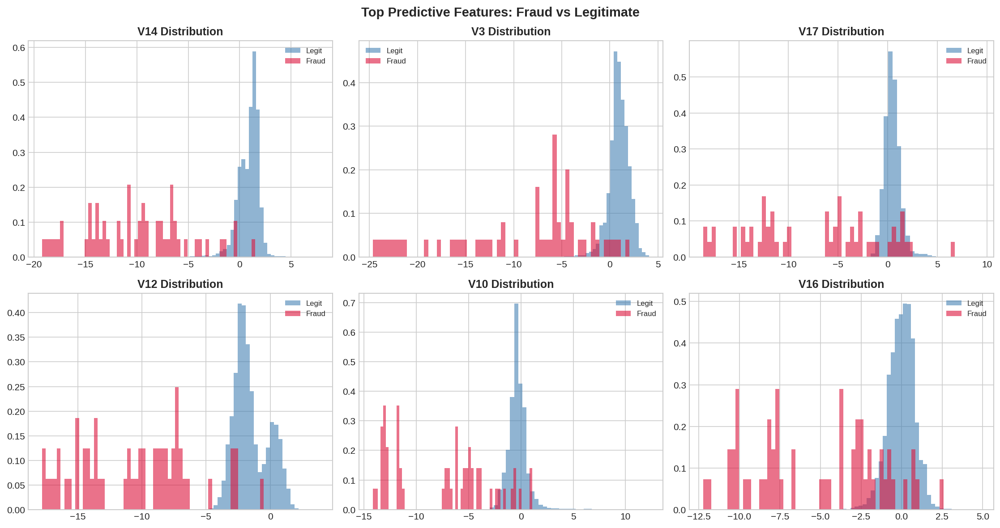

# End-to-End ML Pipeline with MLflow
### Credit Card Fraud Detection · Random Forest · SMOTE · FastAPI · Streamlit

---

## Overview

A production-grade machine learning pipeline for real-time credit card fraud detection.
Trained on 284,807 transactions (492 fraud cases — 0.17% imbalance), this project demonstrates
the full ML lifecycle: data preprocessing, experiment tracking, model registry, automated
retraining, REST API serving, and an interactive dashboard.

**Key finding:** SMOTE oversampling reduced missed fraud cases from 19 to 13 out of 98 test
fraud transactions — a 32% reduction in undetected fraud compared to the baseline.

---

## Architecture

```
creditcard.csv
      │
      ▼
preprocess.py ──── SMOTE / Class Weight / Baseline
      │
      ▼
train.py ──────── 5 Experiments ──── MLflow Tracking
      │                                     │
      ▼                                     ▼
retrain.py ───── Scheduled            Model Registry
(24hr loop)      Retraining           (fraud-detector)
                                             │
                                             ▼
                                       api/main.py
                                       (FastAPI · port 8000)
                                             │
                                             ▼
                                    dashboard/app.py
                                    (Streamlit · port 8501)
```

---

## Results

### MLflow Experiment Comparison


| Run | Sampling Strategy | Recall | ROC-AUC | Fraud Missed | False Alarms |
|---|---|---|---|---|---|
| RF-baseline-no-sampling | None | 0.8061 | 0.9741 | 19 | 5 |
| RF-class-weight-balanced | Class Weight | 0.8163 | 0.9804 | 18 | 19 |
| RF-smote | SMOTE | **0.8673** | 0.9797 | **13** | 26 |
| RF-smote-tuned | SMOTE | 0.8469 | 0.9770 | 15 | 13 |
| GBM-smote | SMOTE | 0.8673 | 0.9777 | 13 | 71 |

> **Best model: RF-smote (v1)** — highest recall with far fewer false alarms than GBM.
> Accuracy is intentionally de-emphasised: 99.96% accuracy on imbalanced data is meaningless.
> Recall and ROC-AUC are the metrics that matter.


---

## Dataset Analysis

### Class Imbalance


284,807 transactions. 492 fraud (0.17%). A naive model that predicts "legit" every time
achieves 99.83% accuracy — which is why accuracy is the wrong metric here.

### Feature Distributions



V1–V28 are PCA-transformed features (anonymized for privacy). Amount and Time are the
only raw features — both scaled using StandardScaler before training.

### Correlation Heatmap


### Transaction Time Patterns


Fraud transactions cluster differently in time compared to legitimate ones —
visible in the distribution shape above.

---

## Live Dashboard

### Experiment Results Page


### Legitimate Transaction


### Fraud Detected


### Production Model Info


---

## MLflow Model Registry


Models are registered automatically when recall > 0.85 and ROC-AUC > 0.97.
The best model is promoted to the `production` alias and loaded by the API at startup.

---

## Project Structure

```
ml-pipeline-mlflow/
├── data/
│   └── creditcard.csv          ← Kaggle dataset (not in repo)
├── src/
│   ├── preprocess.py           ← Scaling, SMOTE, train/test split
│   ├── train.py                ← 5 MLflow experiments
│   └── retrain.py              ← Scheduled retraining loop
├── api/
│   └── main.py                 ← FastAPI inference server
├── dashboard/
│   └── app.py                  ← Streamlit UI
├── Screenshots/                ← README images
├── Dockerfile
├── docker-compose.yml
└── requirements.txt
```

---

## Quickstart

### 1. Clone and install

```bash
git clone https://github.com/AdithyaRaoK14/End-to-End-ML-Pipeline-with-MLflow.git
cd ml-pipeline-mlflow

python -m venv venv
source venv/bin/activate        # Windows: venv\Scripts\activate
pip install -r requirements.txt
```

### 2. Download dataset

```bash
# From Kaggle: https://www.kaggle.com/datasets/mlg-ulb/creditcardfraud
# Place creditcard.csv in data/
```

### 3. Start MLflow

```bash
mlflow ui --port 5000
# Open http://localhost:5000
```

### 4. Run experiments

```bash
python src/train.py
# Runs 5 experiments, logs to MLflow, registers best model
```

### 5. Set production alias

```bash
python -c "
import mlflow
from mlflow.tracking import MlflowClient
mlflow.set_tracking_uri('http://localhost:5000')
client = MlflowClient()
client.set_registered_model_alias('fraud-detector', 'production', '1')
print('Done')
"
```

### 6. Start API

```bash
uvicorn api.main:app --host 0.0.0.0 --port 8000 --reload
# API docs: http://localhost:8000/docs
```

### 7. Start dashboard

```bash
streamlit run dashboard/app.py
# Dashboard: http://localhost:8501
```

### Docker (alternative)

```bash
docker-compose up --build
```

---

## API Reference

**Base URL:** `http://localhost:8000`

| Endpoint | Method | Description |
|---|---|---|
| `/predict` | POST | Predict fraud for a transaction |
| `/health` | GET | API and model health status |
| `/model-info` | GET | Production model metrics and params |
| `/threshold-info` | GET | Precision-recall tradeoff explanation |
| `/docs` | GET | Interactive Swagger UI |

### Example Request

```bash
curl -X POST http://localhost:8000/predict \
  -H "Content-Type: application/json" \
  -d '{
    "features": [-2.3122, 1.952, -1.6099, 3.9979, -0.5222,
                 -1.4265, -2.5374, 1.3917, -2.7701, -2.7723,
                  3.202, -2.8999, -0.5952, -4.2893, 0.3897,
                 -1.1407, -2.8301, -0.0168, 0.417, 0.1269,
                  0.5172, -0.035, -0.4652, 0.3202, 0.0445,
                  0.1778, 0.2611, -0.1433],
    "amount": 0.0,
    "time": 406.0
  }'
```

### Example Response

```json
{
  "transaction_id": "txn_1779165548002",
  "is_fraud": true,
  "fraud_probability": 0.8921,
  "risk_level": "HIGH",
  "latency_ms": 76.1,
  "model_version": "v1"
}
```

---

## Tech Stack

| Component | Technology |
|---|---|
| ML Training | scikit-learn, imbalanced-learn |
| Experiment Tracking | MLflow 3.12 |
| Model Registry | MLflow Model Registry |
| API | FastAPI + Uvicorn |
| Dashboard | Streamlit |
| Containerization | Docker + Docker Compose |
| Data | pandas, numpy |
| Visualization | matplotlib, seaborn |

---


## Dataset

[Credit Card Fraud Detection](https://www.kaggle.com/datasets/mlg-ulb/creditcardfraud) — Kaggle

284,807 transactions · 492 fraud cases · 0.17% fraud rate  
Features V1–V28 are PCA-transformed (anonymized). Raw features: Amount, Time.

---

*Related: [CodeIntel-RAG](https://github.com/AdithyaRaoK14/CodeIntel-RAG-Agentic-Codebase-Intelligence-Platform-with-MCP.git) — Agentic RAG platform for codebase intelligence*
